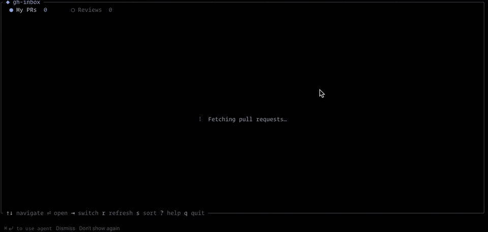

# gh-inbox

A terminal dashboard for your GitHub pull requests. See everything at a glance — your open PRs, pending review requests, CI status, and more — without leaving the terminal.

<p align="center">
  
</p>

## Features

**My PRs** — All your open pull requests across every repo, with:
- CI status (passing, failing, pending)
- Review status (approved, changes requested, pending)
- Stale PR indicator (no activity in 7+ days)
- Draft PR support

**Stats** — Your throughput at a glance:
- PRs merged per week (last 12 weeks)
- PRs reviewed per week (last 12 weeks)

**Review Requests** — PRs where your review has been requested, with:
- Direct vs team request indicator
- Author and request age
- Merged/closed PRs automatically excluded

**General**
- Color-coded repos for quick visual grouping
- Keyboard-driven navigation
- Opens PRs directly in your browser
- Progressive loading — lists appear instantly, statuses fill in
- Single binary, runs from anywhere

## Install

### Homebrew

```sh
brew install chasenyc/tap/gh-inbox
```

### From source

Requires [Rust](https://rustup.rs) and the [GitHub CLI](https://cli.github.com) (`gh`).

```sh
cargo install --git https://github.com/chasenyc/gh-inbox.git
```

This installs `gh-inbox` to `~/.cargo/bin/`, which is on your `$PATH` if you installed Rust via rustup.

### From a release binary

Download the latest binary from [Releases](https://github.com/chasenyc/gh-inbox/releases) and place it somewhere on your `$PATH`:

```sh
# macOS / Linux
chmod +x gh-inbox
mv gh-inbox /usr/local/bin/
```

## Prerequisites

You must be authenticated with the GitHub CLI:

```sh
gh auth login
```

`gh-inbox` reads your token from `gh auth token` — no separate API token or config file needed.

## Usage

```sh
gh-inbox
```

### Keybindings

| Key | Action |
|---|---|
| `↑` / `↓` | Navigate rows |
| `Enter` | Open PR in browser |
| `Tab` | Switch between My PRs and Reviews |
| `1` / `2` / `3` | Jump to a specific tab |
| `s` | Toggle sort order (newest/oldest) |
| `r` | Refresh data |
| `?` | Help |
| `q` / `Esc` | Quit |

## License

MIT
